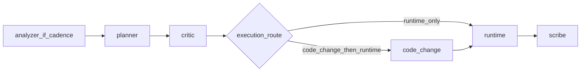

# Subagent iterative experiment (orchestration)

The **parent Cursor Agent** is the **lead**: it holds `run_state`, invokes custom subagents in order, and applies [policies.md](policies.md). Specialist work is delegated to `.cursor/agents/experiment-*.md` per [Cursor Subagents](https://cursor.com/docs/subagents).

**Do not** nest subagents. Only the lead chains them.

## References (read before running)

| Doc | Purpose |
|-----|---------|
| [contracts.md](contracts.md) | Handoff schemas |
| [policies.md](policies.md) | Budget, taxonomy, auto-unblock, scribe path, comparability |
| [notebook-conventions.md](notebook-conventions.md) | Notebook layout for code-change |
| [examples.md](examples.md) | Sample payloads |
| [iterative-experiment/SKILL.md](../iterative-experiment/SKILL.md) | Baseline notebook loop (unchanged) |
| [iterative-experiment/strategies.md](../iterative-experiment/strategies.md) | Strategy priority for planner |
| [run-notebook-on-colab/SKILL.md](../run-notebook-on-colab/SKILL.md) | SCP, papermill, SSH |
| [gpu-review/SKILL.md](../gpu-review/SKILL.md) | GPU audit; runtime preflight = **Critical** only |

## Inputs (gather from user)

| Input | Required | Example |
|-------|----------|---------|
| Notebook path | Yes | `notebooks/ad_hoc/experiment_foo.ipynb` |
| Goal metric + threshold | Yes | `Hit@50 > 0.2` |
| Max rounds | No (default 3) | `3` |
| K hypotheses per round | No (default 3) | `3` |
| Colab hostname | Yes for runtime | `*.trycloudflare.com` |

Resolve short notebook names by searching `notebooks/`.

## Phase 0 — Lead setup

1. Read notebook; summarize baseline (model, loss, data, current metrics if any).
2. Derive **`scribe_doc_path`** per [policies.md](policies.md): `experiments/logs/YYYYMMDD_<notebook_stem>_trail.md`. Create `experiments/logs/` if needed.
3. Establish Colab SSH (run-notebook-on-colab Phase 2); store `hostname`.
4. Initialize `run_state`: `best_*`, `critic_replan_streak: 0`, `last_analyzer_round: null`, round `1`.

## Per-round flow (strict order)

1. **Analyzer** (if cadence says so): invoke `/experiment-analyzer` with handoff per [contracts.md](contracts.md). Append `analyzer_pack` for planner.
2. **Planner**: `/experiment-planner` — K hypotheses, `strategies.md` order, diversity.
3. **Critic**: `/experiment-plan-critic` — accept/reject, budget 30m, set `execution_route` and `needs_replan`.
4. If `needs_replan`: increment `critic_replan_streak`; if streak **≥ 3**, escalate; on auto-unblock without user, **stop** and scribe (see policies). Else planner again (same round number).
5. **Code-change**: if `execution_route == code_change_then_runtime`, invoke `/experiment-code-change`. If `runtime_only`, skip.
6. **Runtime**: `/experiment-runtime` — follow run-notebook-on-colab Phase 3; preflight = execution-safe + GPU **Critical** only (see policies).
7. **Scribe**: `/experiment-scribe` — append trail, leaderboard rows with **comparability** tags, evidence-only observations.
8. Update `run_state`, check goal / max rounds, continue or final summary.

## Routing rules

- **`execution_route`**: `code_change_then_runtime` if any accepted hypothesis has `requires_code_change: true`; else `runtime_only`. Critic must not rewrite per-hypothesis flags.
- **Failures**: If runtime returns `failure_is_execution_safe: false` for OOM/TIMEOUT/CODE (semantic), lead surfaces options; then [auto-unblock](policies.md#auto-unblock-policy) may route to code-change for **operational downgrade** only. Never auto-apply **scientific** changes.

## Subagent invocation

Use explicit subagent names (e.g. `/experiment-planner`) or natural language. **Always** paste a **Handoff block** (see contracts.md) — subagents have no chat history.

## Validation checklist

See [validation.md](validation.md).

## Edge cases

| Case | Action |
|------|--------|
| Colab disconnect | Re-prompt hostname; resume from last scribe round |
| Shared cell changed | code-change sets `cache_invalidation_needed`; user or lead deletes listed caches |
| Goal met mid-round | Stop after scribe; print leaderboard |
| User available | User choices override auto-unblock |
