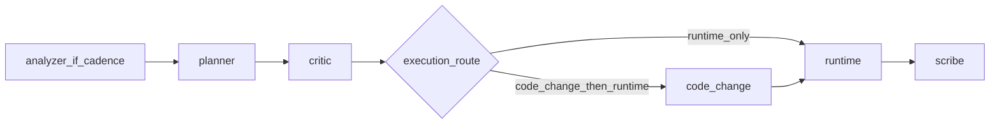

# Subagent iterative experiment (orchestration)

The **lead** holds `run_state`, invokes custom subagents in order, and applies [policies.md](policies.md). Specialist work is delegated to `~/.claude/agents/experiment-*.md` (global Claude agents).

**Do not** nest subagents. Only the lead chains them.

## References (read before running)

| Doc | Purpose |
|-----|---------|
| [contracts.md](contracts.md) | Handoff schemas |
| [policies.md](policies.md) | Budget, taxonomy, auto-unblock, scribe path, comparability |
| [notebook-conventions.md](notebook-conventions.md) | Notebook layout for code-change |
| [examples.md](examples.md) | Sample payloads |
| [iterative-experiment/SKILL.md](../iterative-experiment/SKILL.md) | Baseline notebook loop (unchanged) |
| [iterative-experiment/strategies.md](../iterative-experiment/strategies.md) | Strategy priority for planner |
| [run-notebook-on-colab/SKILL.md](../run-notebook-on-colab/SKILL.md) | SCP, papermill, SSH |
| [gpu-review/SKILL.md](../gpu-review/SKILL.md) | GPU audit; runtime preflight = **Critical** only |

## Inputs (gather from user)

| Input | Required | Example |
|-------|----------|---------|
| Notebook path | Yes | `notebooks/ad_hoc/experiment_foo.ipynb` |
| Goal metric + threshold | Yes | `Hit@50 > 0.2` |
| Max rounds | No (default 3) | `3` |
| K hypotheses per round | No (default 3) | `3` |
| Colab hostname | Yes for runtime | `*.trycloudflare.com` |

Resolve short notebook names by searching `notebooks/`.

## Phase 0 — Lead setup

1. Read notebook; summarize baseline (model, loss, data, current metrics if any).
2. Derive **`scribe_doc_path`** per [policies.md](policies.md): `experiments/logs/YYYYMMDD_<notebook_stem>_trial.md`. Create `experiments/logs/` if needed.
3. Establish Colab SSH (run-notebook-on-colab Phase 2); store `hostname`.
4. Initialize `run_state`: `best_*`, `critic_replan_streak: 0`, `last_analyzer_round: null`, round `1`.

## Per-round flow (strict order)



Each numbered step below MUST be a **Task tool call** to the named subagent. Do NOT do the work inline.

1. **Analyzer** (if cadence says so): **delegate to `/experiment-analyzer`** with handoff per [contracts.md](contracts.md). Append `analyzer_pack` for planner.
2. **Planner**: **delegate to `/experiment-planner`** — K hypotheses, `strategies.md` order, diversity.
3. **Critic**: **delegate to `/experiment-plan-critic`** — accept/reject, budget 30m, set `execution_route` and `needs_replan`.
4. If `needs_replan`: increment `critic_replan_streak`; if streak **≥ 3**, escalate; on auto-unblock without user, **stop** and scribe (see policies). Else delegate to planner again (same round number).
5. **Code-change**: if `execution_route == code_change_then_runtime`, **delegate to `/experiment-code-change`**. If `runtime_only`, skip.
6. **Runtime**: **delegate to `/experiment-runtime`** — uses scp + papermill (NEVER git push); preflight = execution-safe + GPU **Critical** only (see policies).
7. **Scribe**: **delegate to `/experiment-scribe`** — append trial log, leaderboard rows with **comparability** tags, evidence-only observations.
8. Lead updates `run_state`, checks goal / max rounds, continues or prints final summary. This is the ONLY step the lead does itself.

## Routing rules

- **`execution_route`**: `code_change_then_runtime` if any accepted hypothesis has `requires_code_change: true`; else `runtime_only`. Critic must not rewrite per-hypothesis flags.
- **Failures**: If runtime returns `failure_is_execution_safe: false` for OOM/TIMEOUT/CODE (semantic), lead surfaces options; then [auto-unblock](policies.md#auto-unblock-policy) may route to code-change for **operational downgrade** only. Never auto-apply **scientific** changes.

## Subagent invocation (MANDATORY)

**You MUST delegate specialist work to subagents using the Task tool.** Do NOT perform planner/critic/code-change/runtime/scribe/analyzer work inline in the lead conversation. Each step in the per-round flow MUST be a Task tool call to the corresponding `experiment-*` subagent.

How to invoke: use the Task tool with `subagent_type` set to the appropriate type, or invoke by name (e.g. `/experiment-planner`). **Always** paste a **Handoff block** (see contracts.md) in the task prompt — subagents have no chat history.

The lead's job is to **orchestrate and route**, not to propose hypotheses, review proposals, edit notebooks, execute on Colab, write trial logs (the `*_trial.md` artifact), or analyze history. If you find yourself doing any of those directly, stop and delegate to the correct subagent instead.

## File sync: scp only, NEVER git

**CRITICAL:** To sync notebooks to Colab, use `scp` per [run-notebook-on-colab/SKILL.md](../run-notebook-on-colab/SKILL.md). **NEVER** use `git add`, `git commit`, `git push`, or any git-based workflow to transfer files to the Colab runtime. The Colab environment reads from Drive, and `scp` writes directly there over SSH. Git round-trips are slow, unnecessary, and break the workflow.

**Also critical — no git *inside* the notebook during that run:** Many Colab notebooks run `git fetch` / `git reset --hard origin/main` to refresh the repo in the browser. That **overwrites** the `scp`’d notebook with GitHub `main` and **voids** the local copy you intended to execute. For experiment notebooks managed by **experiment-runtime**, preflight / **experiment-code-change** should **disable or gate** those cells (e.g. `SKIP_GIT_REPO_SYNC`) so **papermill** runs exactly the synced file. See [run-notebook-on-colab/SKILL.md](../run-notebook-on-colab/SKILL.md) (“No git inside the notebook execution path”) and [compatibility.md](../run-notebook-on-colab/compatibility.md) §5.

```bash
sshpass -p "cursorssh" scp <SSH_OPTS> \
  <LOCAL_NOTEBOOK_PATH> \
  root@<HOSTNAME>:/content/drive/MyDrive/colab/recsys_playground/recsys_playground/<NOTEBOOK_PATH>
```

This applies to:
- experiment-runtime (preflight fixes then scp)
- experiment-code-change edits (lead or runtime scps the result)
- Any retry/re-run cycle (re-scp, not git push)

## Validation checklist

See [validation.md](validation.md).

## Edge cases

| Case | Action |
|------|--------|
| Colab disconnect | Re-prompt hostname; resume from last scribe round |
| Shared cell changed | code-change sets `cache_invalidation_needed`; user or lead deletes listed caches |
| Goal met mid-round | Stop after scribe; print leaderboard |
| User available | User choices override auto-unblock |
